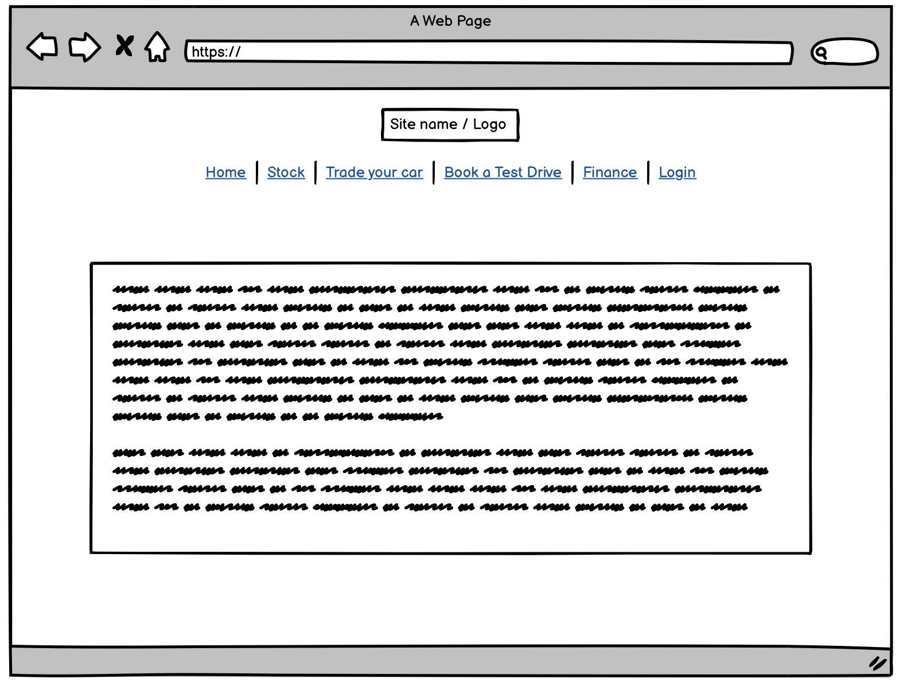
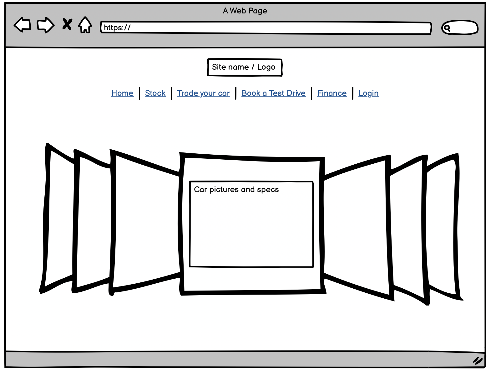
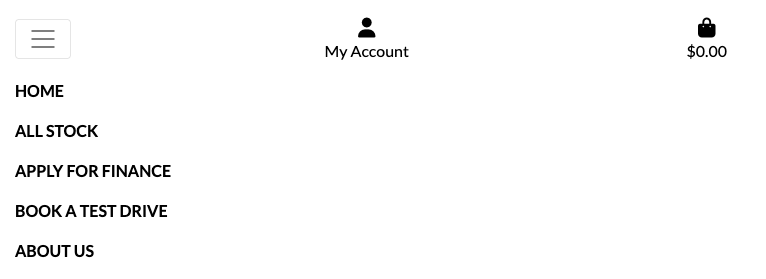
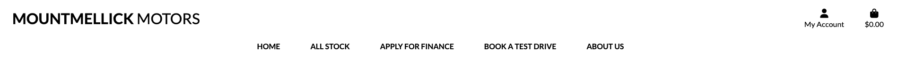
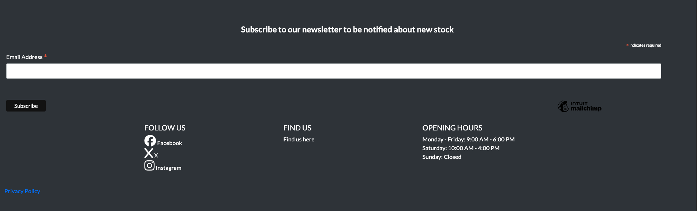

# Mountmellick Motors
### Car dealership E-Commerce Business

### [Link to the live site](https://mountmellick-motors-59b177d11415.herokuapp.com/)

### Overview

For my final project of this course I have decided to build a Car Dealership E-Commerce site. I decided to build a car dealership site as the company I currently work for builds websites for Irish Car dealers and I felt this would be a good way to showcase the skills I have learned throughout the year at the code institute. Although purchasing a car outright is not something we would typically do online, I felt this would be a fun take on an e-commerce store and is easily customisable to fit a real world scenario. 

## Site User Goals
The main goals for users of my site would be to browse a wide range of cars for sale in the midlands so they can purchase a new car in their local area without having to travel too far to a bigger city. 
They would also be looking for flexible financing options and the ability to test drive the car so they can be sure they want to buy it and are happy with how it performs which in turn gives them peace of mind.
They also want to be able to simply browse vehicles without having to create an account but can also stay up to date by easily signing up to a newsletter informing them immediately when new stock is available

## Site Owner Goals
The main goals for the site owner are to provide an easy-to-navigate platform where users can browse a diverse range of cars for sale in the Midlands,just as they could in a bigger city.

They also want to be able to offer finance options to make their vehicles more accesible to a cariety of customers, which will help them sell more cars and in turn, generate a greater profit. Facilitating test drives of the cars also shows transparency and builds trust with their local community. 

The site owner also wants to make the site easy for staff to use with the integration of a product management section for superusers, so that staff members can upload new vehicles for sale easily with little room for user error. 

Finally, the site owner wants to keep generating traffic via the newsletter. If the newsletter is easy to sign up to, then users are likely to return when they are notified of new stock on site. 

### Brand Identity & Colour Palette

The brand identity of Mountmellick Motors is supposed to feel local, but professional. The colour scheme used is simple but also maintains a feel of professionalism that a user would expect from a car dealership. I included the Mountmellick crest as the favicon to really hammer home the feeling of a local business but maintain sleekness with the colour scheme used throughout the site and with the hero image. 

### Wireframes

I made a few basic wireframes on Balsamiq so I would have a rough idea of what I wanted the site to look like. Although I did not stick to them entirely, they did give me a good foundation to work with. 

## Data Structure
I created a rough data structure on paper first so I would have an idea of how I wanted my models to relate to each other and this really helped me to keep things organised. I have also attempted to complete one online so you can visualise what I was aiming for:

# Agile Development

I did my best to follow the Agile development method by using Github User stories, issues, Kanban board, the Moscow system and milestones. This was a great help in terms of keeping me on track and being able to clearly visualize what work I had completed and what was left to do, as well as planning future implementations.

# User Stories

As mentioned above, I used Github projects to help me keep track of user stories, which can be found here - 

Here are some of the most important user stories:

- #### Set up workspace
As a Developer I can set up my workspace so that I can write my code and follow along to the botique ado walkthrough with ease.

- #### Set up folders and file paths
As a Developer I can set up folders and ensure file paths are correct so that everything works as intended

- #### Create 3 custom models
As a developer I can set up 3 custom models so that I am meeting the minimum pass criteria for this assignment

- #### Set up allauth
As a Developer I can install and set up allauth so that users of my site can create an account and log in

- #### Set up Stripe
As a Developer I can set up Stripe so that users of my site can securely make payments

# Features

I wanted the site to be as easy to use and accessible as possible, so the only pages that require the user to log in or create an account are the test drives bookingpage and the profile page. Only superusers can access the product management page and have access to edit stock on the site. 

## Base

The base.html page contains all of the header and Footer code that is transferred across the site when it is loaded into other pages, as well as other important pages and info such as Javascript, messages, meta tags etc.
The nav is broken up between main-nav.html and mobile-top-header.html to make them both more customisable without taking up too much space on the base file. 

I wanted the footer to contain as much info as possible without feeling cramped and overloaded 

### Index

The index page AKA the home page, is the landing page for the site. I wanted it to be visually appealling and grab the user's attention immediately hence the flashy BMW as the hero image. The user can then see the button for viewing stock too. The home page also contains the Header and Footer, as do all other pages on the site 

<h1></h1>

### About

I kept the about page very simple. It just gives a few key details about the dealership and why they should choose mountmellick motors for buying their next vehicle. 

<h1></h1>
<h1></h1>

### bag

The bag contains all the contents of the users shopping bag. Heavily inspired by the boutique ado walkthrough. 

<h1></h1>

### Checkout

The checkout along with stripe implementation were taken directly from the boutique ado walkthrough. I really enjoyed this part of the walkthrough as I know Stripe is a very powerful and uselful tool to know how to work with in my future career as a developer. That said, it was also the most challenging part of the walkthrough for me. 

<h1></h1>

### Finance

The finance page is broken up into 3 pages, Finance info, Finance application and finance success. I wanted all users of the site to be able to access this site, which in turn will generate more leads for the car dealership. If the finance applications were locked behind a sign up process, the dealership may lose leads. This is typical of the automotive industry. I also included buttons to the finance application form on the stock page to drive more traffic and increase leads. 

<h1></h1>

### Test Drives
The test drive application form is only available to people with an account on site. This is to ensure that if you have a test drive booked, it is stored on your user profile so you can edit and delete your appointment. I did not want this available to just anyone who accesses the site, as this could lead to a lot of bookings and potential no shows. I wanted only serious buyers to have access to test drives, ensuring higher quality leads. 

<h1></h1>

### Stock
The stock page is the bread and butter for the site. This is where users can find information about all of the cars in stock on the site. I wanted each vehicle to live inside of a bootstrap card with a button for applying for finance or booking a test drive. I think the bootstrap card layout on this page give is a very neat and proffessional feel. I also added edit and delete buttons for super users so they can edit or delete stock from the site. 

<h1></h1>

### Profile
The profile was heavily inspired by the boutique ado walkthrough and then further expanded upon by adding test drives to the bottom of the page where the user can edit and delete their test drive bookings too. Users can also save their address info to the checkout and see previous order history.

<h1></h1>

### Newsletter
The newsletter was placed at the top of the footer so it is easily visible. I only wanted one required field of email so this made it really accessible for people to sign up to so they can stay up to date with new stock on the site and in turn increase traffic to the site with returning users. 

<h1></h1>

### Privacy Policy

I generated a standard privacy policy and linked this in the footer. 

<h1></h1>

### Custom 404 page
Custom 404 page is thrown when a user enters a wrong or invalid link on site

<h1></h1>

## Features Left To Implement

There are a number of features I would like to implement for future sprints on this site:

- A wishlist so users can save cars they are considering purchasing
- A reviews section which would be linked to an active google profile 
- a searchbar so users can search for specific items or categories
- An accessories tab in the store so users can purchase car accessories
- form validation on test drives booking form so users can only book for a future date
- Instead of paying the full amount for the vehicle, the user pays a deposit to secure the vehicle

# Web Marketing Strategies

In the web marketing module of the course we were tasked with creating a list of questions to consider when creating a marketing plan for our E-Commerce store.

- Who is the target audience for the site?
- Where does the target audience for the site usually look when buying a new car?
- Do they typically use social media?
- What is most important to potential users when buying a new car?
- What do people typically search for when buying a new car?

Short-Tail Keywords:
- Used Cars
- Car Dealership
- Car Finance
- Test Drive
- Buy a Car
- Midlands Cars
- Car Loans
- Affordable Cars
- Best Car Deals
- New Cars

Long-Tail Phrases:
- Used Cars for Sale in the Midlands
- Best Car Dealership in Mountmellick
- Affordable Car Finance Options Ireland
- Test Drive a Car Near Me
- Buy a Reliable Second-Hand Car Locally
- Car Loans for First-Time Buyers Ireland
- Car Finance in the Midlands
- Best Family Cars for Sale in Laois
- How to Apply for Car Finance in Ireland
- Where to Find the Best Car Deals Near Me

<h1></h1>

## Meta Data

img of meta data 

## Sitemap

I used XML-Sitemaps to generate a sitemap file. I downloaded the xml and included in the repository as advised in the course content.

## Robots

I included a robots.txt file. 

## Social Media Marketing

I created a mockup of a business facebook page for the dealership. I think Facebook is best suited as potential buyers may typically search Facebook marketplace when searching for a new car to purchase

<h1></h1>

## Email Marketing
I used Mailchimp to create a newsletter sign up which was then integrated into the footer of the project with only an email address as the required field, to make signing up easy. 

<h1></h1>

# Technology

- Html 
- CSS 
- Font Awesome 
- Google Fonts 
- Bootstrap 
- Javascript
- Python 
- Django Framework
- GitHub 
- Heroku

# Testing

# Deployment

# Credits

